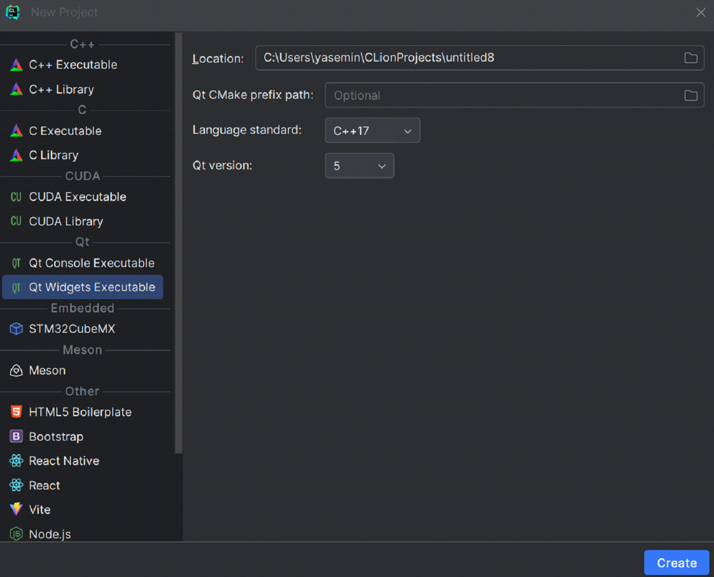
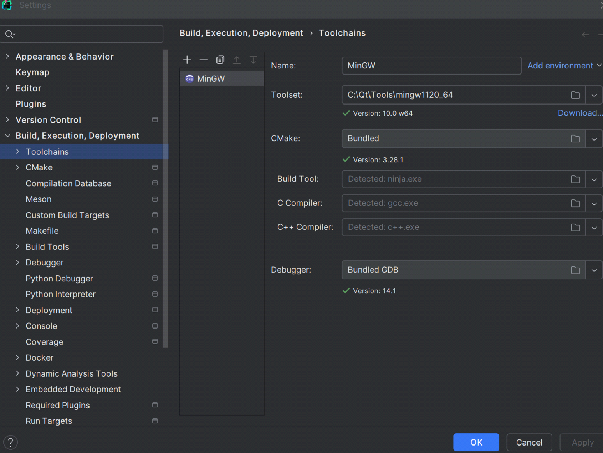
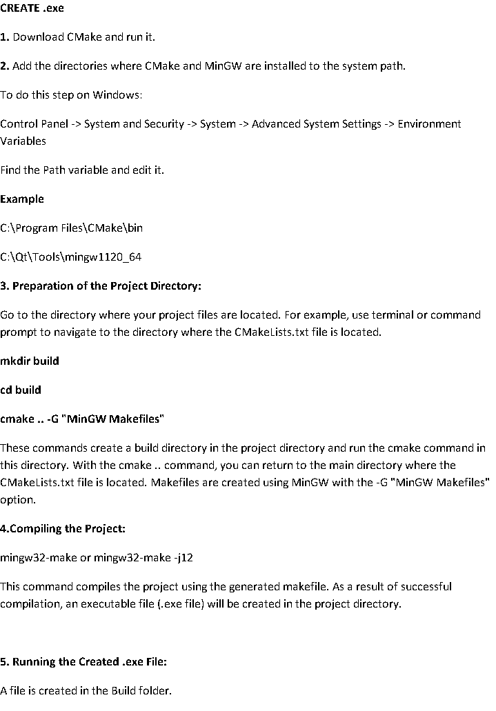

Requirements
1. Download qt
2. Open Qt Widgets Executable

3. Adjust your CMakeLists.txt
4. Run it with you editor.From  Settings- Build, Execution, Deployment.

5. Create Form Files folder and create a new QT UI Class with right click.
6. Run the application.

7. REFERENCES
   
   https://www.jetbrains.com/help/clion/qt-tutorial.html#cmake-qt

